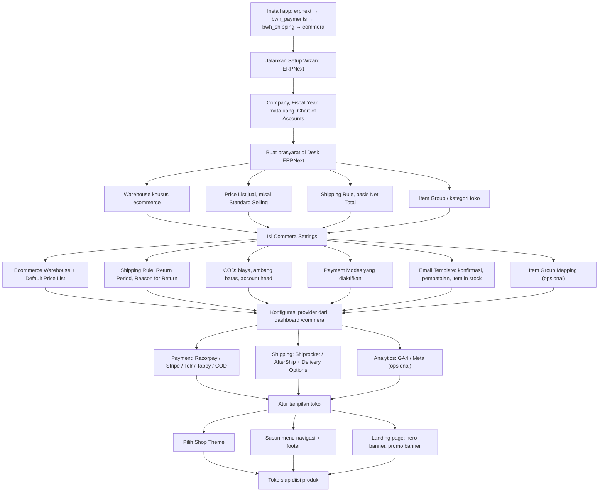
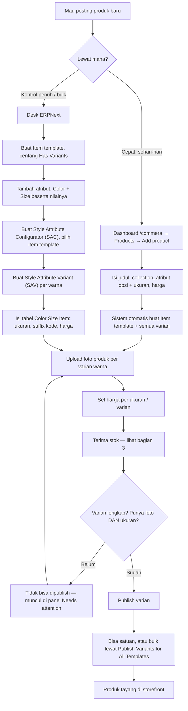
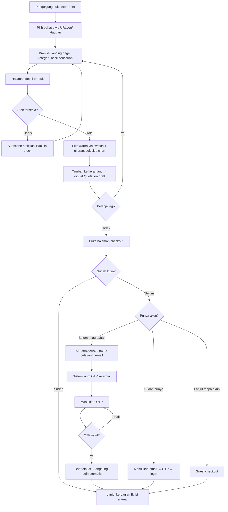
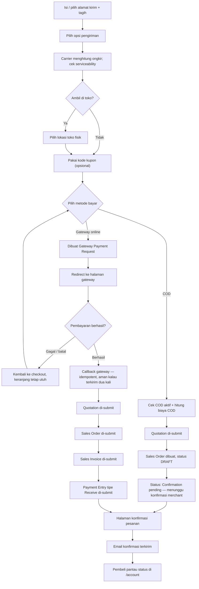
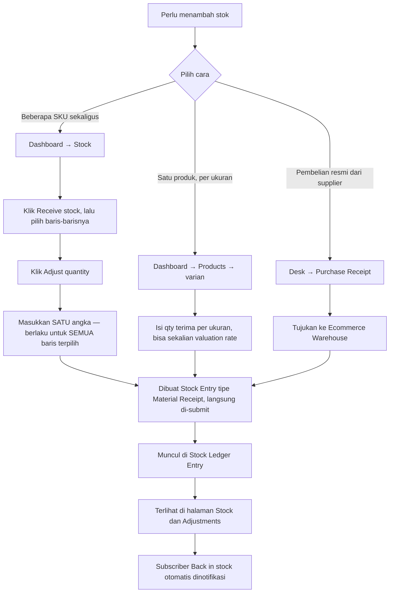
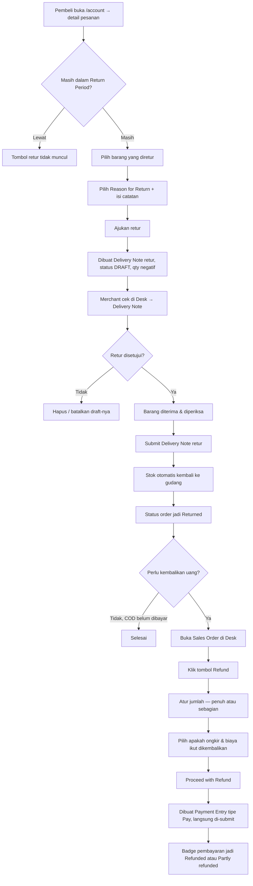

# Panduan Operasional Commera

Dokumen ini menjelaskan **cara memakai** app [`bwhtech/commera`](https://github.com/bwhtech/commera)
dari sisi operasional: alur lengkap dari setup toko sampai pembeli berhasil
checkout, cara memasukkan & merekonsiliasi stok, serta cara membaca laporan
penjualan dan menangani return order.

Untuk daftar fitur, lihat [FEATURES.md](FEATURES.md). Untuk referensi setting
per field dan per checkbox di tiap DocType, lihat
[CONFIGURATION.md](CONFIGURATION.md). Untuk prosedur build/deploy image-nya,
lihat [../README.md](../README.md).

Perintah di dokumen ini ditulis generik — ganti `<site-name>` dengan nama site
kamu, dan jalankan `bench` dari dalam container backend
(`docker exec -it <backend-container> bench --site <site-name> ...`) kalau
deployment-nya pakai Docker.

---

## Daftar Isi

1. [Konsep dasar: Commera menulis ke dokumen ERPNext](#1-konsep-dasar-commera-menulis-ke-dokumen-erpnext)
2. [Flowchart lengkap](#2-flowchart-lengkap)
   - [2.1 Setup toko](#21-setup-toko-sekali-di-awal)
   - [2.2 Posting item / produk](#22-posting-item--produk)
   - [2.3 Alur pembeli: kunjungan → sign up → checkout](#23-alur-pembeli-kunjungan--sign-up--checkout-berhasil)
   - [2.4 Alur end-to-end](#24-alur-end-to-end-gabungan)
3. [Stok: input & rekonsiliasi](#3-stok-input--rekonsiliasi)
4. [Laporan penjualan](#4-laporan-penjualan)
5. [Return order & refund](#5-return-order--refund)

---

## 1. Konsep dasar: Commera menulis ke dokumen ERPNext

Commera **tidak punya database order/stok sendiri**. Semua aksi di storefront
maupun dashboard berakhir jadi dokumen ERPNext standar. Ini penting dipahami
sebelum baca sisanya — kalau ada angka yang aneh, sumber kebenarannya selalu
dokumen ERPNext di bawah ini, bukan tampilan dashboard.

| Yang dilihat user       | Dokumen ERPNext sebenarnya                                        |
| ----------------------- | ----------------------------------------------------------------- |
| Keranjang belanja       | `Quotation` (draft)                                               |
| Proses bayar di gateway | `Gateway Payment Request` (dari `bwh_payments`)                   |
| Pesanan                 | `Sales Order`                                                     |
| Tagihan                 | `Sales Invoice`                                                   |
| Pembayaran masuk        | `Payment Entry` tipe **Receive**                                  |
| Refund                  | `Payment Entry` tipe **Pay**                                      |
| Pengiriman / fulfilment | `Delivery Note`                                                   |
| Retur barang            | `Delivery Note` dengan `is_return = 1` (qty negatif)              |
| Terima stok             | `Stock Entry` tipe **Material Receipt**                           |
| Riwayat pergerakan stok | `Stock Ledger Entry`                                              |
| Produk                  | `Item` (template) + `Style Attribute Variant` + `Color Size Item` |

Konsekuensi praktisnya: apa pun yang tidak bisa dilakukan dari dashboard Commera,
**hampir selalu bisa dilakukan dari Desk ERPNext** dengan dokumen di atas — dan
dashboard akan langsung ikut berubah karena membaca sumber yang sama.

---

## 2. Flowchart lengkap

### 2.1 Setup toko (sekali di awal)



**Langkah detail:**

1. **Install app sesuai urutan** — `erpnext` → `bwh_payments` → `bwh_shipping`
   → `commera`. Urutan wajib karena `commera/hooks.py` mendeklarasikan
   `required_apps = ["frappe/erpnext", "bwhtech/bwh_payments", "bwhtech/bwh_shipping"]`.

   ```bash
   bench --site <site-name> install-app erpnext
   bench --site <site-name> install-app bwh_payments
   bench --site <site-name> install-app bwh_shipping
   bench --site <site-name> install-app commera
   ```

   > ⚠️ `SETUP_GUIDE.md` upstream masih menyuruh install `webshop` dan `payments`.
   > **Itu sudah usang** — `required_apps` versi sekarang tidak menyebut keduanya,
   > dan `bwh_payments` menggantikan peran app `payments`.

2. **Jalankan Setup Wizard ERPNext lebih dulu** sebelum apa pun. Kalau `commera`
   diinstal di site yang belum punya Company/Fiscal Year, hook `after_install`-nya
   akan error saat membuat email template default. Errornya tidak fatal (install
   tetap selesai), tapi template-nya tidak terbentuk.

3. **Siapkan prasyarat di Desk** — Warehouse ecommerce, Price List, Shipping Rule
   (basis _Net Total_, misal gratis ongkir di atas 500rb), dan Item Group untuk
   kategori toko.

4. **Isi Commera Settings** (Desk → Commera Ecommerce → Commera Settings). Ini
   pusat konfigurasi toko:
   - **Ecommerce Warehouse** — gudang yang dipakai untuk semua stok & order toko.
     Wajib diisi; tanpa ini fitur terima stok akan menolak jalan.
   - **Default Price List** / **Sale Price List**.
   - **Shipping Rule**, **Return Period** (jumlah hari boleh retur),
     **Reason for Return** (daftar alasan yang bisa dipilih pembeli).
   - **COD** — biaya COD, nilai order di bawah mana biaya itu berlaku, dan
     account head-nya.
   - **Payment Modes** — metode bayar mana yang aktif.
   - **Email Template** — konfirmasi order, pembatalan, dan notifikasi item
     kembali tersedia.
   - **Item Group Mapping** (opsional) — memetakan Item Group ERPNext yang sudah
     ada ke kategori toko, lalu klik _Sync Item Group Mapping to Existing Items_.

5. **Konfigurasi provider dari dashboard** `/commera`, bukan dari Desk. Payment
   gateway, shipping carrier, dan koneksi analytics semuanya punya panel sendiri
   di sana. Masing-masing bisa diaktifkan terpisah.

6. **Atur tampilan** — pilih theme, susun navbar/footer (ada live preview), isi
   hero & promo banner di Landing Page Settings.

> 💡 Mau lihat toko yang sudah jadi dulu? Commera punya demo data bawaan —
> tombol install demo data ada di Commera Settings, atau jalankan
> `bench --site <site-name> execute commera.install_demo_data.execute`.

---

### 2.2 Posting item / produk

Ada dua jalur, dan keduanya berakhir di struktur data yang sama
(`Item` template → `Style Attribute Variant` → `Color Size Item`).



**Langkah detail:**

1. **Jalur dashboard (paling cepat).** Products → _Add product_. Cukup isi judul,
   collection, atribut opsi (mis. Color) + ukuran beserta nilainya, dan harga —
   company, warehouse, price list, UOM, dan naming series otomatis diambil dari
   Commera Settings.
   - Nama atribut ukuran **wajib persis `Size`**. Nama lain akan gagal di tengah
     proses generate varian.
   - Judul produk tidak boleh diawali `"New Item"` (kata itu dicadangkan Frappe).
   - Produk tanpa varian (misal buku) tetap bisa: kosongkan opsi/ukuran, sistem
     pakai nilai tersembunyi sebagai fallback.

2. **Jalur Desk (untuk kasus kompleks / migrasi bulk).**
   1. Buat `Item` template, centang **Has Variants**, tambahkan atribut Color &
      Size di tab Attributes.
   2. Buat **Style Attribute Configurator (SAC)** → pilih item template dan
      atribut utama (biasanya Color). Di sini juga tempat mengisi _Recommended
      Items_ yang muncul sebagai "You May Also Like".
   3. Buat **Style Attribute Variant (SAV)** untuk tiap warna → isi Attribute
      Value, prefix kode item, gambar, lalu tabel **Color Size Item** untuk tiap
      ukuran (suffix kode, harga, centang publish).

3. **Upload foto.** Per varian warna. Untuk banyak produk sekaligus pakai
   **Bulk Image Upload** (Desk → Commera Ecommerce → Bulk Image Upload), hasilnya
   punya log tersendiri.

4. **Publish.** Satuan dari dashboard, atau massal lewat tombol _Publish Variants
   for All Templates_ di Commera Settings tab Bulk Actions.
   > Varian **tidak akan mau dipublish** kalau belum punya gambar **dan** ukuran —
   > sistem otomatis meng-unpublish dan memberi pesan mana yang kurang. Varian
   > seperti ini muncul di panel _Needs attention_ pada halaman Overview dashboard.

---

### 2.3 Alur pembeli: kunjungan → sign up → checkout berhasil

Alur penuhnya dipecah jadi dua bagian yang bersambung di titik **"Isi alamat"**,
supaya tiap diagram tetap terbaca.

**Bagian A — dari membuka toko sampai punya identitas:**



**Bagian B — dari alamat sampai pesanan jadi:**



**Langkah detail:**

1. **Masuk & jelajah.** Bahasa ditentukan lewat URL (`/en/`, `/ar/`) memakai
   sistem translasi native Frappe. Halaman produk di-render server-side, jadi
   cepat dan terbaca crawler.

2. **Produk habis stok?** Pembeli bisa berlangganan notifikasi _back in stock_;
   tersimpan sebagai `OOS Notify Subscription` dan dikirim otomatis saat stok
   masuk lagi.

3. **Tambah ke keranjang** → di belakang layar dibuat `Quotation` draft milik
   sesi tersebut. Keranjang bertahan selama Quotation-nya masih draft.

4. **Sign up — berbasis OTP email, tanpa password.** Alurnya:
   - Pembeli isi nama depan, nama belakang, email → sistem kirim OTP.
   - Email yang sudah terdaftar akan ditolak di langkah ini ("Email already in use").
   - Pembeli masukkan OTP → kalau cocok, record `User` dibuat dan pembeli
     **langsung login otomatis** tanpa perlu set password.
   - OTP sekali pakai (langsung dihapus dari cache setelah dipakai).
   - Rate limit: pengiriman OTP maks. 30×/jam; verifikasi maks. 5× per 5 menit
     **per alamat email** (bukan per IP — supaya kode 6 digit tidak bisa
     di-brute force dengan ganti-ganti IP).
   - Login untuk user lama jalurnya sama: email → OTP → masuk.
   - **Guest checkout tetap didukung** — pembeli boleh menyelesaikan pesanan
     tanpa membuat akun sama sekali.

5. **Alamat & pengiriman.** Ongkir dihitung oleh carrier yang aktif (Shiprocket
   cek serviceability per kode pos; AfterShip untuk global). Delivery Options
   menentukan pilihan apa saja yang muncul. Kalau toko mengaktifkan pickup, pembeli
   bisa memilih lokasi toko fisik sebagai ganti pengiriman.

6. **Pembayaran — dua jalur yang berbeda hasilnya:**

   |                     | **COD**                 | **Gateway online**     |
   | ------------------- | ----------------------- | ---------------------- |
   | Quotation           | di-submit               | di-submit              |
   | Sales Order         | dibuat, **tetap draft** | dibuat & **di-submit** |
   | Sales Invoice       | ❌ belum dibuat         | ✅ dibuat & di-submit  |
   | Payment Entry       | ❌ belum ada            | ✅ Receive, di-submit  |
   | Status di dashboard | _Confirmation pending_  | _To fulfil_            |

   Jadi **order COD sengaja berhenti sebagai draft** dan menunggu merchant
   mengonfirmasi — itulah arti badge _Confirmation pending_. Meski begitu, order
   COD draft **tetap dihitung sebagai penjualan** di semua laporan (lihat
   [bagian 4](#4-laporan-penjualan)).

   Callback gateway bersifat **idempotent**: webhook yang datang berbarengan
   dengan kembalinya pembeli ke situs tidak akan membuat order/tagihan dobel.

7. **Setelah berhasil.** Pembeli dibawa ke halaman konfirmasi, email konfirmasi
   terkirim, dan pesanan bisa dipantau dari `/account` — termasuk status
   pengiriman dan tombol ajukan retur.

---

### 2.4 Alur end-to-end (gabungan)

Ini rangkaian penuh dari sisi merchant dan pembeli, lengkap sampai order selesai
atau diretur. Label tahapan di bawah sama persis dengan yang muncul di badge
dashboard.

```mermaid
flowchart LR
    subgraph SETUP["1 · Setup"]
        A1["Install app"] --> A2["Setup Wizard"] --> A3["Commera Settings"] --> A4["Payment + Shipping + Theme"]
    end

    subgraph KATALOG["2 · Katalog"]
        B1["Buat produk"] --> B2["Foto + harga"] --> B3["Terima stok"] --> B4["Publish"]
    end

    subgraph SHOPPER["3 · Pembeli"]
        C1["Kunjungi toko"] --> C2["Masuk keranjang"] --> C3["Sign up via OTP / guest"] --> C4["Alamat + ongkir"] --> C5["Bayar"]
    end

    subgraph ORDER["4 · Pemenuhan"]
        D1["Confirmation pending — COD saja"] --> D2["To fulfil"]
        D2 --> D3["Preparing — Delivery Note draft"]
        D3 --> D4["Packed — Packing Slip"]
        D4 --> D5["Shipped"]
        D5 --> D6["Delivered"]
    end

    subgraph AKHIR["5 · Penutup"]
        E1["Returned"]
        E2["Cancelled"]
        E3["Selesai"]
    end

    A4 --> B1
    B4 --> C1
    C5 --> D1
    D6 --> E3
    D6 --> E1
    D2 --> E2
```



**Tahapan status order** (dashboard menampilkan tahapan **terjauh** yang sudah
dicapai sebuah order):

| Tahap                            | Artinya                              | Dipicu oleh                 |
| -------------------------------- | ------------------------------------ | --------------------------- |
| `Confirmation pending`           | Order masih draft, menunggu merchant | Order COD baru masuk        |
| `To fulfil`                      | Sudah dikonfirmasi, belum diproses   | Sales Order di-submit       |
| `Preparing for shipment`         | Sedang disiapkan                     | Ada Delivery Note draft     |
| `Packed`                         | Sudah dikemas                        | Ada Packing Slip            |
| `Partly fulfilled` / `Fulfilled` | Sebagian / seluruh barang dikirim    | `per_delivered` Sales Order |
| `Shipped`                        | Paket sudah bergerak                 | Status dari carrier         |
| `Delivered`                      | Sampai di tujuan                     | Status dari carrier         |
| `Returned`                       | Diretur                              | Delivery Note retur         |
| `Cancelled`                      | Dibatalkan                           | Sales Order di-cancel       |

Tombol **Fulfil order** di dashboard membuat `Delivery Note` dari sisa barang
yang belum terkirim, lalu langsung men-submit-nya — **di titik inilah stok benar-benar
keluar dari gudang.** Tombol ini otomatis hilang untuk order yang sudah
dibatalkan, diretur, terkirim, atau sudah sampai.

---

## 3. Stok: input & rekonsiliasi

### ⚠️ Hal terpenting yang perlu diketahui lebih dulu

**Commera hanya bisa MENAMBAH stok, tidak bisa menyetel stok ke angka tertentu.**

Satu-satunya operasi tulis stok di seluruh app adalah _receive stock_ yang
sifatnya **aditif** — selalu menambah, tidak pernah menetapkan. Kolom _On hand_
di halaman Stock bersifat **read-only**, dan halaman _Adjustments_ juga
**read-only** (cuma menampilkan riwayat).

Artinya: **rekonsiliasi/opname stok tidak bisa dilakukan dari Commera.** Itu
harus lewat dokumen `Stock Reconciliation` di Desk ERPNext. Ini keputusan desain,
bukan bug — Commera sengaja tidak membuat ledger penyesuaian tandingan, dan
memilih membaca ledger asli milik ERPNext.

### 3.1 Cara memasukkan stok



**Langkah detail:**

1. **Dari dashboard, banyak baris sekaligus** — menu **Stock**:
   1. Klik **Receive stock** (atau **Select**) untuk masuk mode pilih.
   2. Centang baris SKU yang mau ditambah.
   3. Klik **Adjust quantity**, masukkan jumlah.
   4. ⚠️ Angka yang kamu masukkan **ditambahkan ke setiap baris terpilih** —
      satu nilai untuk semua. Jadi memilih 10 baris lalu mengisi `5` berarti
      +5 untuk masing-masing dari 10 SKU itu, bukan 5 dibagi rata.

2. **Dari halaman produk, per ukuran** — Products → pilih produk → varian. Di
   sini kamu bisa mengisi jumlah berbeda per ukuran, plus **valuation rate**
   (harga pokok) per baris. Kalau valuation rate dikosongkan, sistem memakai
   nilai valuasi item itu sendiri.

3. **Dari Desk, untuk pembelian resmi** — buat `Purchase Receipt` seperti biasa
   dengan target Ecommerce Warehouse. Cara ini yang benar kalau stok datang dari
   pembelian supplier, karena utang dan harga pokoknya ikut tercatat.

**Yang terjadi di belakang layar:** semua cara di atas menghasilkan `Stock Entry`
bertipe **Material Receipt** yang langsung di-submit ke Ecommerce Warehouse
(gudang dari Commera Settings). Kalau Ecommerce Warehouse belum diisi, prosesnya
ditolak dengan pesan _"Set Ecommerce Warehouse in Commera Settings before
receiving stock"_.

### 3.2 Cara rekonsiliasi / stock opname

Karena Commera tidak menyediakannya, pakai dokumen ERPNext:

1. Buka **Desk → Stock → Stock Reconciliation → New**.
2. **Purpose**: `Stock Reconciliation`.
3. Tambahkan baris item, isi **Qty** dengan **jumlah hasil hitung fisik**
   (angka absolut, bukan selisih), dan **Warehouse** = Ecommerce Warehouse.
4. Isi **Valuation Rate** bila perlu menyesuaikan harga pokok.
5. Submit.

Setelah submit, selisihnya otomatis muncul di halaman **Adjustments** dashboard
dengan label alasan **"Stock count"**. Commera memang sudah menyiapkan pemetaan
label untuk jenis dokumen ini walaupun tidak bisa membuatnya sendiri.

**Mengeluarkan stok** (barang rusak, hilang, dipakai internal): buat `Stock Entry`
tipe **Material Issue** dari Desk. Muncul di Adjustments sebagai **"Removed"**.

### 3.3 Membaca halaman Stock

| Kolom         | Artinya                                                      |
| ------------- | ------------------------------------------------------------ |
| **On hand**   | Stok fisik di gudang (`Bin.actual_qty`). Read-only.          |
| **Committed** | Sudah dipesan pembeli tapi belum dikirim (`reserved_qty`).   |
| **Available** | `On hand − Committed` — inilah yang benar-benar bisa dijual. |

Filter **Low stock only** memakai ambang **5 unit** secara default. Ambang ini
bisa diubah per produk lewat _restock level_, yang tersimpan sebagai
`Item.safety_stock`.

### 3.4 Membaca halaman Adjustments

Halaman ini **read-only** dan menampilkan seluruh pergerakan stok di Ecommerce
Warehouse, terbaru di atas, langsung dari `Stock Ledger Entry`. Kolom **Reason**
diterjemahkan dari jenis dokumen sumbernya:

| Label           | Dokumen asal                                         |
| --------------- | ---------------------------------------------------- |
| **Received**    | Stock Entry (Material Receipt) atau Purchase Receipt |
| **Removed**     | Stock Entry (Material Issue)                         |
| **Transferred** | Stock Entry (Material Transfer)                      |
| **Sold**        | Delivery Note atau Sales Invoice                     |
| **Stock count** | Stock Reconciliation                                 |

---

## 4. Laporan penjualan

### ⚠️ Definisi "penjualan" di Commera

Sebelum membandingkan angka Commera dengan laporan standar ERPNext, pahami dulu
aturannya. Sebuah `Sales Order` dihitung sebagai penjualan bila:

- `order_type` = **"Shopping Cart"** — order yang dibuat manual di Desk **tidak
  ikut terhitung**; dan
- **belum dibatalkan** — order **draft pun tetap dihitung**, karena order COD
  memang lahir sebagai draft dan itu pendapatan sungguhan.

Angka pendapatan menjumlahkan **`base_grand_total`** (mata uang perusahaan),
bukan `grand_total`, supaya bisa dijumlahkan lintas order dengan mata uang berbeda.

Konsekuensinya: **angka Commera tidak akan sama persis dengan laporan Sales
Analytics bawaan ERPNext**, karena ERPNext biasanya hanya menghitung dokumen yang
sudah di-submit. Perbedaan ini disengaja, bukan selisih yang perlu dikejar.

### 4.1 Overview — ringkasan cepat

Halaman depan dashboard `/commera`, jendela **30 hari terakhir**, dibandingkan
dengan 30 hari sebelumnya:

- **Revenue** — pendapatan + persentase perubahan.
- **Orders** — jumlah pesanan + persentase perubahan.
- **Orders to fulfil** — antrean yang perlu diproses, plus catatan _"Oldest
  waiting since ..."_ untuk melihat mana yang paling lama menggantung.
- **Products live** — jumlah varian yang tayang.
- Panel **Running low** (stok menipis) dan **Needs attention** (varian yang belum
  bisa dipublish karena kurang foto/ukuran).

### 4.2 Analytics → Revenue

Laporan bulanan untuk N bulan terakhir. Per bulan tersedia:

- **Revenue** — pendapatan
- **Orders** — jumlah pesanan
- **AOV** — _average order value_, pendapatan ÷ jumlah pesanan
- **Discounts** — total diskon yang diberikan
- **Refunds** — total dana yang dikembalikan

Ditambah perbandingan total terhadap periode sebelumnya yang sama panjangnya.

> 🔒 Laporan ini hanya bisa diakses role **System Manager**.

### 4.3 Analytics → Inventory

- **Nilai stok** — stok di tangan dihargai dengan **harga jual hari ini**, bukan
  valuasi harga pokok ERPNext. Jadi bacanya: _"berapa nilai jual isi rak saya"_.
- **Sell-through / velocity** — laju penjualan per produk, plus estimasi berapa
  hari stok akan bertahan. Produk yang belum terjual sama sekali ditampilkan
  sebagai kosong, bukan nol — supaya tidak salah dibaca "stok cukup selamanya".
- **Dead stock** — barang yang masih ada di gudang tapi **tidak laku sama sekali
  dalam 30 hari terakhir**, lengkap dengan tanggal terakhir terjual.

### 4.4 Analytics → Storefront

Dari data tracking first-party milik sendiri (tidak ada data yang keluar dari
situs):

- Funnel kunjungan → lihat produk → masuk keranjang → checkout → beli
- Timeseries penjualan & heatmap (jam/hari paling ramai)
- Produk terlaris dan tingkat keterlibatan per produk
- Sumber trafik, pembagian device, halaman pendaratan
- **Keranjang terbengkalai** (abandoned carts)
- **Live view** — aktivitas yang sedang berlangsung
- **Tracking health** — cek apakah tracking benar-benar jalan

Kalau GA4 dan/atau Meta dihubungkan, dashboard **membaca balik** angka dari
kedua platform itu lewat GA4 Data API dan Graph API, jadi funnel eksternal
tampil berdampingan dengan angka pendapatan sendiri.

### 4.5 Laporan standar ERPNext

Karena semuanya dokumen ERPNext asli, seluruh laporan bawaan tetap berlaku dan
justru lebih tepat untuk kebutuhan akuntansi: **Sales Analytics**, **Sales
Register**, **Item-wise Sales History**, **Gross Profit**, **Accounts
Receivable**, **Stock Balance**, **Stock Ledger**.

---

## 5. Return order & refund

### Retur dan refund adalah dua hal terpisah

Ini sumber kebingungan paling umum: **mengajukan retur barang tidak otomatis
mengembalikan uang.** Keduanya dokumen berbeda dan langkah berbeda.

- **Retur** → `Delivery Note` retur (barang kembali ke gudang)
- **Refund** → `Payment Entry` tipe Pay (uang kembali ke pembeli)



### 5.1 Sisi pembeli — mengajukan retur

1. Login ke `/account`, buka detail pesanan.
2. Tombol retur hanya muncul bila masih dalam **Return Period** yang diatur di
   Commera Settings.
3. Pilih barang mana yang diretur (bisa sebagian), pilih **Reason for Return**
   dari daftar yang sudah kamu siapkan, dan isi catatan bila perlu.
4. Ajukan.

Sistem membuat `Delivery Note` retur berstatus **draft**: menunjuk ke Delivery
Note asli, qty negatif, dengan alasan dan catatan pembeli tersimpan di
`custom_reason_for_return` dan `custom_return_remarks`.

> Draft ini **bukan** retur yang selesai. Stok belum kembali sampai merchant
> men-submit-nya. Halaman akun pembeli membedakan retur yang masih draft
> (diajukan) dan yang sudah submit (disetujui), jadi pembeli tidak bisa mengajukan
> retur dobel untuk barang yang sama.

### 5.2 Sisi merchant — memproses retur

1. Buka **Desk → Stock → Delivery Note**, cari dokumen retur berstatus draft
   (qty negatif).
2. Periksa barang fisiknya setelah sampai.
3. **Submit** kalau disetujui — stok otomatis masuk kembali ke gudang dan status
   order berubah jadi **Returned** di dashboard.
4. Kalau ditolak, batalkan/hapus draft-nya.

Retur juga bisa diajukan atas nama pembeli oleh staf, asalkan punya izin
_create_ pada Delivery Note.

### 5.3 Refund

Refund dilakukan dari **Sales Order di Desk**, bukan dari dashboard:

1. Buka `Sales Order` terkait.
2. Klik tombol **Refund** (hanya muncul kalau order memang layak direfund —
   order draft dan order yang sudah direfund penuh tidak menampilkannya).
3. Di dialog, atur:
   - **Refund Amount** — bisa penuh atau sebagian. Nilainya dibatasi otomatis
     ke sisa yang memang masih bisa dikembalikan.
   - **Refund Charges** — centang kalau ongkir dan biaya lain ikut dikembalikan;
     lepas centang untuk mengembalikan nilai barangnya saja.
4. **Proceed with Refund** → dibuat `Payment Entry` tipe **Pay** yang langsung
   di-submit, membalik akun dari pembayaran aslinya.

Pengaman yang sudah ada di dalamnya:

- Order **dikunci** selama proses, sehingga dua refund bersamaan tidak bisa
  membayar dobel.
- Jumlah refund **selalu diklem** di sisi server ke sisa yang benar-benar masih
  bisa dikembalikan — batas di dialog browser bukan satu-satunya penjaga.
- Refund yang melintasi mata uang ditolak dan diarahkan ke desk akuntansi.
- Refund parsial berkali-kali diakumulasi; sisa refundable ikut berkurang tiap kali.

### 5.4 Membatalkan order

Membatalkan order lewat fitur _cancel_ akan **otomatis memicu refund penuh**
bila order itu **bukan** COD. Untuk order COD tidak ada refund karena memang
belum ada uang yang diterima.

### 5.5 Status pembayaran di dashboard

| Badge                | Artinya                                                 |
| -------------------- | ------------------------------------------------------- |
| **Paid**             | Ada Payment Entry Receive yang sudah di-submit          |
| **Payment pending**  | Belum ada pembayaran diterima                           |
| **Cash on delivery** | Order COD — ditagih di tempat, di luar alur dokumen ini |
| **Partly refunded**  | Sebagian dana sudah dikembalikan                        |
| **Refunded**         | Dana dikembalikan penuh                                 |

> Catatan teknis: Payment Entry refund tidak menyimpan referensi langsung ke
> pembayaran aslinya. Pencocokannya dilakukan lewat kombinasi
> `reference_no` + party + company. Kalau kamu membuat refund manual dari Desk
> tanpa lewat tombol **Refund**, dan `reference_no`-nya tidak diisi sama dengan
> pembayaran asli, **dashboard tidak akan mengenalinya sebagai refund** dan badge
> pembayarannya akan tetap _Paid_.

---

## Referensi cepat

| Mau apa                    | Ke mana                                                |
| -------------------------- | ------------------------------------------------------ |
| Konfigurasi toko           | Desk → Commera Ecommerce → Commera Settings            |
| Arti tiap field & checkbox | [CONFIGURATION.md](CONFIGURATION.md)                   |
| Buat produk cepat          | Dashboard `/commera` → Products → Add product          |
| Buat produk kompleks       | Desk → Item template → SAC → SAV                       |
| Tambah stok                | Dashboard → Stock → Receive stock                      |
| Rekonsiliasi stok          | **Desk → Stock Reconciliation** (tidak ada di Commera) |
| Keluarkan stok             | **Desk → Stock Entry → Material Issue**                |
| Riwayat stok               | Dashboard → Stock → Adjustments (read-only)            |
| Proses pesanan             | Dashboard → Orders → Fulfil order                      |
| Laporan penjualan          | Dashboard → Analytics → Revenue                        |
| Setujui retur              | **Desk → Delivery Note** (cari draft qty negatif)      |
| Refund                     | **Desk → Sales Order → tombol Refund**                 |
